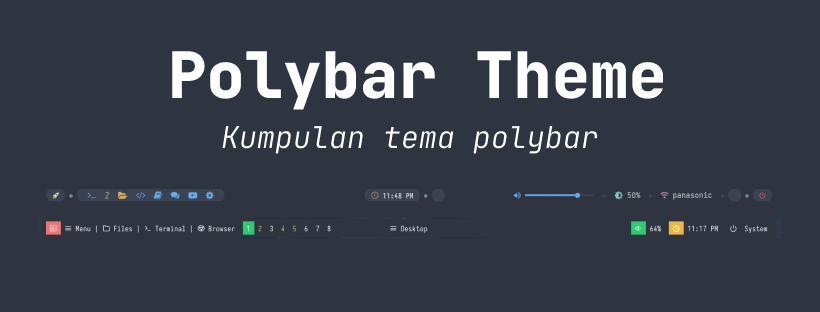

# polybar-theme

## polybar

polybar adalah salah satu panel adalah _standalone_ taskbar atau panel yang dapat kita gunakan sebagai wadah untuk meletakkan berbagai macam status indikator yang kita perlukan.

polybar sangat cocok digunakan pada windows manager seperti _bspwm_, _i3_, _xmonad_, _openbox_ dll.

sebelum menggunakan pada panel polybar, alangkah baiknya kamu menginstall beberapa kebutuhan yang diinginkan seperti

- polybar

    polybar bisa kamu temukan pada repositori official yang terdapat kamu cek [disini](https://github.com/polybar/polybar)

- nerd font

    nerd font adalah salah satu font yang memiliki banyak icon yang digunakan untuk tampilan icon nantinya pada polybar. untuk lebih lanjut tata cara penginstallannya bisa cek [disini](https://github.com/ryanoasis/nerd-fonts)

note : **disarankan untuk kamu menggunakan window manager, tetapi tidak ada masalah jika kamu menggunakan dekstop environment**