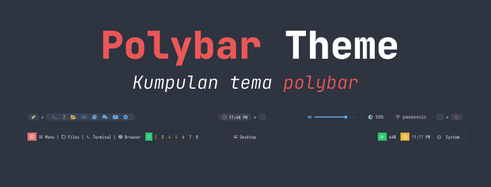

# polybar-theme 

## polybar :fist: :fist:

polybar adalah salah satu panel adalah _standalone_ taskbar atau panel yang dapat kita gunakan sebagai wadah untuk meletakkan berbagai macam status indikator yang kita perlukan.

polybar sangat cocok digunakan pada windows manager seperti _bspwm_, _i3_, _xmonad_, _openbox_ dll.

sebelum menggunakan pada panel polybar, alangkah baiknya kamu menginstall beberapa kebutuhan yang diinginkan seperti

- window manager 💻
    
    window manager adalah salah satu environment yang memudahkan kita dalam memanajemen window aplikasi yang sedang berjalan, sehingga penggunaannya memudahkan user untuk memanage aplikasinya, dan juga memiliki kustomisasi yang bisa dirubah sesuai dari keiinginan user. window manager yang paling populer di kalangan pengguna linux antara lain adalah _bspwm_, _dwm_, _awesome wm_, _i3_, _xmonad_, _openbox_ dan _Qtile_. kamu bisa mendownload salah satu window manager dibawah ini
    - [openbox](http://openbox.org/wiki/Openbox:Download)
    - [bspwm](https://github.com/baskerville/bspwm)
    - [i3](https://i3wm.org/)
    - [xmonad](https://xmonad.org/)
    - [dwm](https://dwm.suckless.org/)
    - [awesome wm](https://awesomewm.org/)
    - [Qtile](http://qtile.org/)

- polybar ⭐
    
    polybar bisa kamu temukan pada repositori official yang terdapat kamu cek [disini](https://github.com/polybar/polybar)

- nerd font :large_orange_diamond:
    
    nerd font adalah salah satu font yang memiliki banyak icon yang digunakan untuk tampilan icon nantinya pada polybar. untuk lebih lanjut tata cara penginstallannya bisa cek [disini](https://github.com/ryanoasis/nerd-fonts)
    
- rofi :tv:
    
    rofi adalah salah satu launcher yang mudah dikustomisasi dan sangat ringat penggunaannya, kita bisa mengganti tema rofi dengan sangat mudah, untuk tata cara penginstallannya bisa cek [disini](https://github.com/davatorium/rofi)

note : **disarankan untuk kamu menggunakan window manager, tetapi tidak ada masalah jika kamu menggunakan desktop environment**
