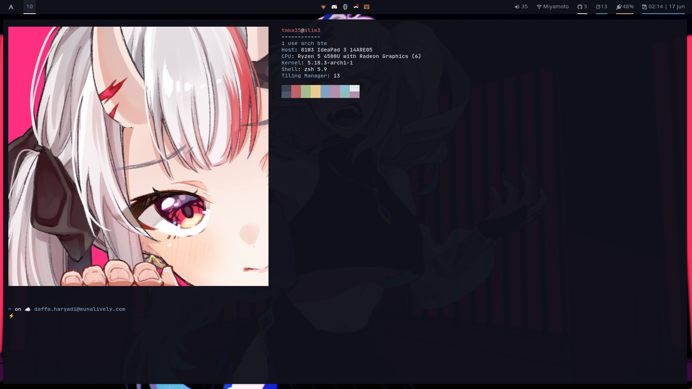

# Minimalist Polybar Theme




## Notifikasi GitHub Script

#### script/github.sh

```sh
username="your username here"
token=`cat ${HOME}/.config/github/github.token`
count=`curl -s -u ${username}:${token} https://api.github.com/notifications | jq '. | length'`

if [[ "$count" != "0" ]]; then
    echo "$count"
fi
```

Untuk menambahkan notifikasi GitHub di panel Polybar, kalian harus membuat token
[GitHub baru](https://docs.github.com/authentication/keeping-your-account-and-data-secure/creating-a-personal-access-token),
lalu menambahkan token kalian di file `~/.config/github/github.token`, kemudian
mengganti username di file script tersebut dengan username kalian.
