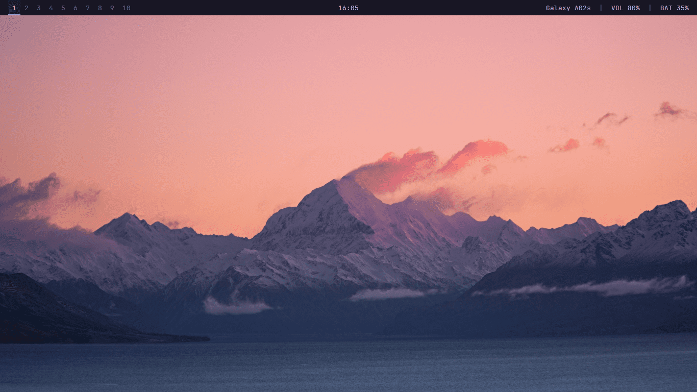

# Skelt Polybar Theme

Tema Polybar dengan konfigurasi minimal untuk memulai.




## Modules & Konfigurasi yang Digunakan

- Font: [JetBrains Mono](https://www.jetbrains.com/lp/mono/) (bukan yang Nerd Fonts)
- Warna palet: [Rosé Pine](https://rosepinetheme.com/)
- Window manager: [bspwm](https://github.com/baskerville/bspwm)
- Audio server: [ALSA](https://alsa-project.org/wiki/Main_Page)

## Pengguna Window Manager i3

Jika kamu menggunakan window manager [i3](https://i3wm.org/), kamu bisa
merubah module dan konfigurasi seperti berikut:

```ini
modules-left = i3

override-redirect = true

wm-restack = i3

[module/i3]
type = internal/i3
```

Contoh lebih lengkap untuk i3 silakan
[kunjungi wiki](https://github.com/polybar/polybar/wiki/Module:-i3#basic-settings).

## Pengguna Audio Server PulseAudio

Jika kamu menggunakan audio server
[PulseAudio](https://wiki.freedesktop.org/www/Software/PulseAudio/), kamu bisa
merubah module dan konfigurasi seperti berikut:

```ini
modules-right = wlan pulseaudio battery

[module/pulseaudio]
type = internal/pulseaudio
```

Contoh lebih lengkap untuk PulseAudio silakan
[kunjungi wiki](https://github.com/polybar/polybar/wiki/Module:-pulseaudio#basic-settings).

## Lainnya

Jika kamu ingin mengubah font yang digunakan, cukup ubah value `font-0` seperti
berikut:

```ini
font-0 = Nama Font Kamu:size=10;3
```

Jika kamu menggunakan window manager selain bspwm dan i3, ubah `wm-restack`
menjadi `generic` seperti konfigurasi berikut:

```ini
wm-restack = generic
```

Kunjungi
[dokumentasi konfigurasi](https://github.com/polybar/polybar/wiki/Configuration)
lengkapnya untuk lebih lanjut.
